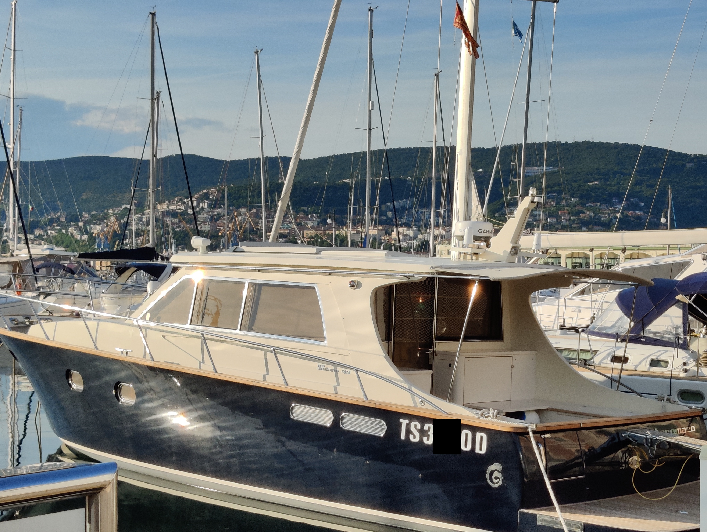
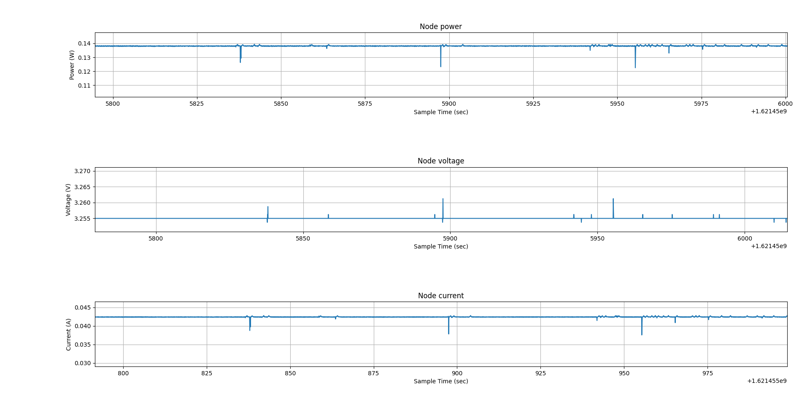

# Performance evaluation

*[First delivery version](https://github.com/kernel-machine/IoTGroupProject/tree/first_assignment/Evaluation.md)*

*[Second delivery version](https://github.com/kernel-machine/IoTGroupProject/tree/second_assignment/Evaluation.md)*

Since our system is used to guide the boats inside a marina it has to be fast and reliable in indicating to each boat what to do.

## Devices performance

To evaluate our solution we first consider the devices performances as follows:

## Camera

The performance of the camera is evaluated by the capability of capturing clear images to be used by the text recognition algorithm. We will consider the percentage of correct text detection on a set of sample images collected in a real marina. The number of images considered is 20.

The percentage of license plates correctly detected is 35%, which is not so satisfying. The main problem is dealing with pictures taken with an angle, because in this case the text recognition algorithm fails. On the other hand, when considering images taken perpendicularly with respect to the text, the algorithm performs well. So in a real implementation an important aspect to take into account is the camera angle with respect to the license plates.

In addition it's reasonable to think that with more sophisticated image transformations the performances could improve even more. In the final implementation the additional text present on the boats is no more a problem for the license plate recognition.

Below are reported two images among those tested. In the first one the algorithm succeeded in the plate recognition, while not in the second. For privacy reasons here the license plates have been partially obscured.

The plate recognition is the slower part of the system, so it has to work as fast as possible. The typical delay measured from when the picture is taken to when the message is received by IoT Core broker is of 2 s, which is an acceptable result.

## Dock devices

#### Precision

It's important to detect with a good accuracy if a boat is present or not, so that the service works well. The goal is to avoid false negative and false positive when a rope is tied on the cleat.

We have tested 10 times the tie off procedure obtaining only 2 false negative and 0 false positive, which is acceptable considering that the cleat model created is a very simple prototype.

#### Power consumption

Since currently IoT LAB LoRa devices are not available due to service maintenance, we cannot evaluate directly the power consumption of the board, but we evaluate it reading the specifications of the chips.

The used board is an ([ST B-L072Z-LRWAN1](https://www.iot-lab.info/docs/boards/st-b-l072z-lrwan1/)) in which there are 2 main components that absorb the most of the current consumption:

- **CPU**, the [STM32L072CZ](https://www.st.com/en/microcontrollers-microprocessors/stm32l072cz.html), has an estimated current consumption of 2.97 mA
- **Radio module**, the [SX1276](https://www.semtech.com/products/wireless-rf/lora-core/sx1276), that has an estimated current consumption of 11 mA during receiving, and at most 23 mA during transmitting.

Another components of the dock device that has a large power consumption is the **LED**, let's assume that we [this light](https://cablematic.com/it/prodotti/luce-a-led-per-semaforo-ip65-200mm-12-24v-verde-SM028/) that has:

- Current consumption of 5.8 W
- Input voltage from 12 to 24 V DC

We assume that each dock is triggered **1 time at day** and a **boat takes 4 minutes** from the enter of the marina, until the anchors to the cleat, So in these 4 minutes the LED has a power consumption of 5.8W x (4/60) h = **0.24 Wh**

The CPU has a current consumption of 2.97 mA, if the board is powered with 3.3V, the power is 0.0098 W, since it is turned on for 24 hours at day, every day, the current consumption is 0.0098 W x 24 h =  0.2352 Wh

From the sum were excluded:

- The power dissipated by the **voltage transformers**
- The power consumption of the **relay** that toggle the light
- Since **LoRa transmission** happens only for few milliseconds at the day, we can exclude it from the total count.
- Li-Ion battery will be used, so we need a **BMS (Battery Management System)** to ensure that when the battery voltage drop below a fixed threshold the dock device is turned off, in such a way to avoid to damage the battery, the BMS has a little power consumption that is not taken into account.
- The power dissipated by the components of the board.

So for every day the power consumption of a dock device is about 0.4752 Wh.

If we use a [4S2P LiIon pack of 18650s](https://it.aliexpress.com/i/4001228530702.html) with a total capacity of 6000 mAh and a voltage of 14.4V, the power that the pack can deliver is 86.4 Wh, and it can power a dock device for about 181 days, about 6 months.

If the customer of these project prefer to power the dock devices with batteries it's possible.

## Signage screens

#### Usability

The evaluation of the screen considers the clarity and visibility of the indications to guide the tourist to the right spot.
If more boats enter in the marina, the screen have to show by cycling the signage for all boats, alternating the signage for different boats. If there are many boats, the delay between the information shown increases.

#### Current consumption

The MQTT messages are not received periodically but only when a boat enter in the marina, so the radio module is used occasionally.

The board has a current consumption of 43 mA without evident peaks.

## Network technology:

The marina server should be able to acquire the sensors data via wireless connection. The server data will be exchanged with the cloud using MQTT protocol over a secure internet connection.

### LoRaWAN

The initial idea was to use 6LoWPAN on [IEEE 802.15.4](https://en.wikipedia.org/wiki/IEEE_802.15.4) based network, to connect the devices between them, the devices are narrow, so the short range of this connection hasn't a problem and this protocol allow us to use ip6 packets, so also MQTT, but using it on the IoT-LAB experiments we got stability and connection problems.

Until 4 nodes this protocol works fine, but with an higher number of nodes we cannot have a reliable connection, we will have about 40 nodes.

For example, on an experiments with 11 node in which:

- 2 nodes are border routers
- 9 nodes are dock devices

Only 3 of the 9 nodes can connect to the border router, so only 33% of nodes. After various experiments we can't get a successfully connection on most of the devices.
Maybe in the IoT-LAB there are a lot of connections and the network could be congested, while in a real scenario it could work fine.
So the future plans is to replace this connection with LoRa so leave also MQTT.

## Response time from an end-user point of view: 

The response time, so the time between a plate detects and signage are shown on the monitors, is below 500 ms. It is not very important to have a real time system, but the system should produce a response in a reasonable time.

Usually the speed limit of the entrance of the marina is about 3 knots, the system In perfect condition has a response time < 500 ms, so the boat in this amount of time, with this speed limit, moves about 77 cm, so our system produces a response in time.

