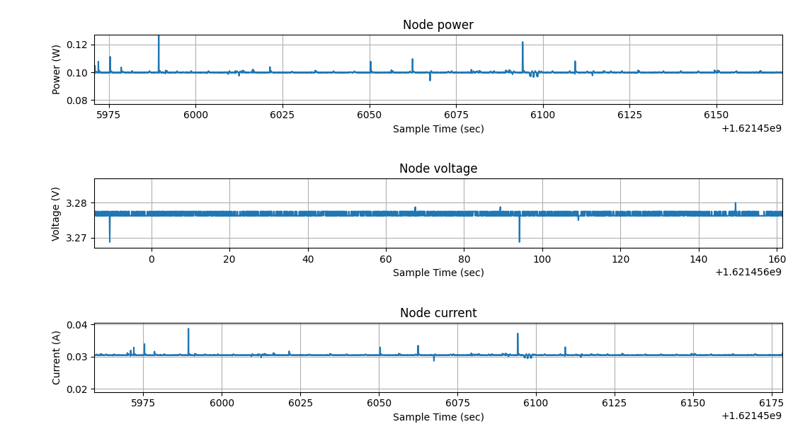
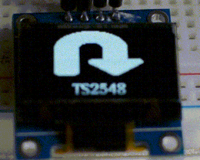

# Performance evaluation:

Since our system is used to guide the boats inside a marina it has to be fast and reliable in indicating to each boat what to do.

## Devices performance

To evaluate our solution we first consider the devices performances as follows:

## Camera

The performance of the camera will be evaluated by the capability of capturing clear images that allows to perform an accurate text recognition. We will consider the percentage of correct text detection on the number of given images.
The camera is the slower part of the system, so it should detect the plate a fast as possible.

## Oil spill sensor

 The performance of this sensor should be evaluated by detecting precisely the ratio of floating oil in the marina.

## Boat detection devices

#### Precision

For this scope an ultrasonic sensor is used, for our propose the precision is not much important, we have to detect only if a boat is present or not.

The main issue for this kind of sensor is that we cannot detect the difference between an out of range measure and a faulty sensor.
When the device measurement is out of range the receiver components doesn't detects any ultrasonic sound and this phenomena could happen also if the receiver or the sender module is damaged.

Another problem of this family of sensors is that they doesn't work fine with sound absorbing material, but for detect boats, that are made by metal or wood, we haven't this problem. 

#### Power consumption

Usually the board has a current consumption of 32 mA.
The radio module is used only when a boat arrives or leaves the dock, and the current raise to 38 mA.

The ultrasonic range finder has a power consumption of 3.38 mA.

The current consumption of this device without the light is 35.4 mA / 41.3 mA for each device.

## Signage screens

#### Usability

The evaluation of the screen considers the clarity and visibility of the indications to guide the tourist to the right spot.
If more boats enter in the marina, the screen have to show by cycling the signage for all boats, alternating the signage for different boats. If there are many boats, the delay between the information shown increases.

#### Current consumption

The MQTT messages are not received periodically but only when a boat enter in the marina, so the radio module is used occasionally.

The board has a current consumption of 43 mA without evident peaks.

## Network technology:

The marina server should be able to acquire the sensors data via wireless connection. The server data will be exchanged with the cloud using MQTT protocol over a secure internet connection.

### 6LoWPAN/RPL

The initial idea was to use 6LoWPAN on [IEEE 802.15.4](https://en.wikipedia.org/wiki/IEEE_802.15.4) based network, to connect the devices between them, the devices are narrow, so the short range of this connection hasn't a problem and this protocol allow us to use ip6 packets, so also MQTT, but using it on the IoT-LAB experiments we got stability and connection problems.

Until 4 nodes this protocol works fine, but with an higher number of nodes we cannot have a reliable connection, we will have about 40 nodes.

For example, on an experiments with 11 node in which:

- 2 nodes are border routers
- 9 nodes are dock devices

Only 3 of the 9 nodes can connect to the border router, so only 33% of nodes. After various experiments we can't get a successfully connection on most of the devices.
Maybe in the IoT-LAB there are a lot of connections and the network could be congested, while in a real scenario it could work fine.
So the future plans is to replace this connection with LoRa so leave also MQTT.

## Response time from an end-user point of view: 

The response time, so the time between a plate detects and signage are shown on the monitors, is below 500 mS. It is not very important to have a real time system, but the system should produce a response in a reasonable time.

Usually the speed limit of the entrance of the marina is about 3 knots, the system In perfect condition has a response time < 500 ms, so the boat in this amount of time, with this speed limit, moves about 77 cm, so our system produces a response in time.

