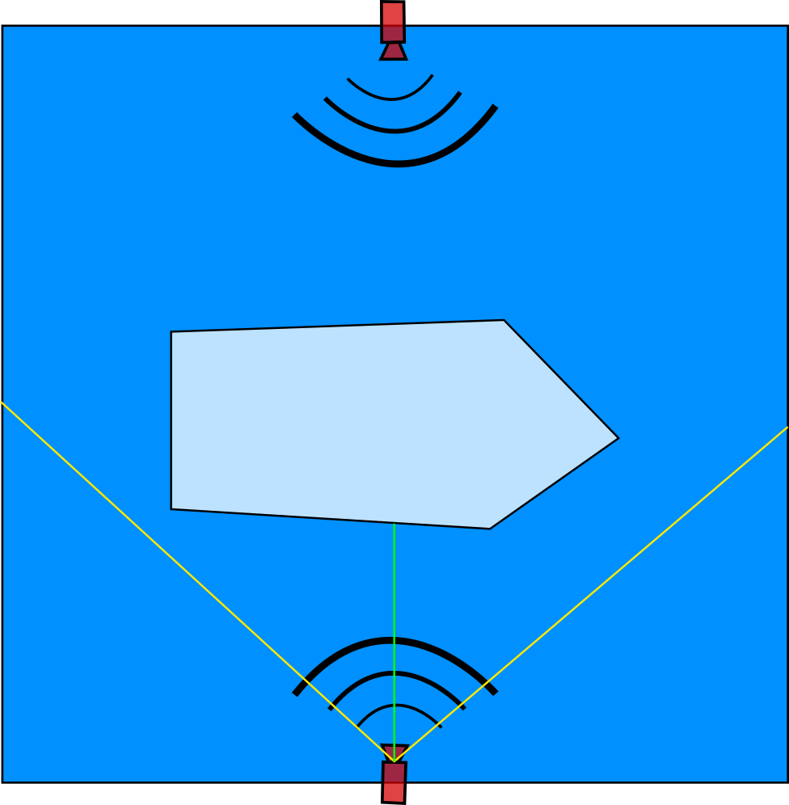
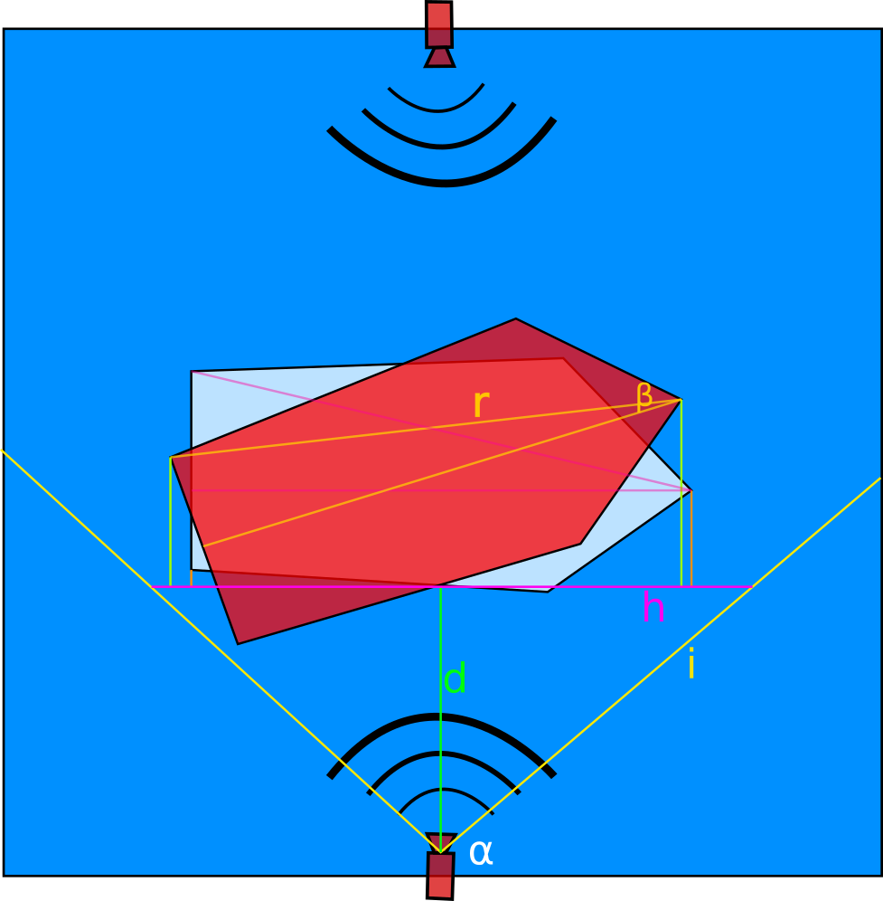
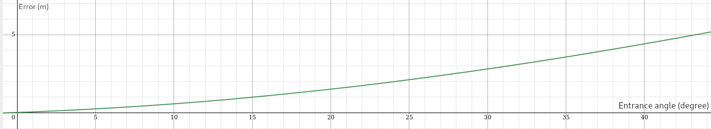
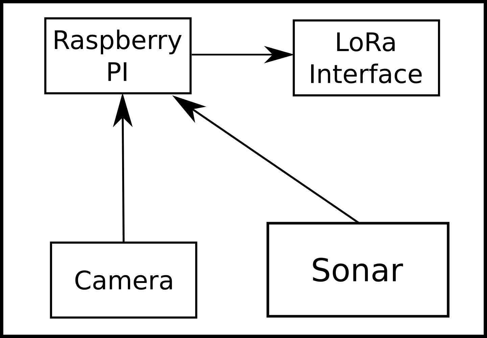

## Technology

## 

The main macro components are:

- **Boat name and size estimator** at the marina entrance there is a set of sensors able to estimate the boat size and get the boat name.
- **Screens**, inside the marina there are some screens, useful to give indications at the sailor to find his dock spot.
- **Park sensor**, for each dock there is a sensor to detect if a boat is presents and a LED that blink when a sailor is searching his dock.

### Boat size estimator

When a boat enters in the marina there are 2 sonar placed in fixed position, one for each side, to estimate the boat width.
There are also 2 cameras used for detect the boat name and to estimate the boat length.

Knowing the field of view of the camera and the distance from the camera (measured by the sonar) we can compute the length of the boat by the taken picture.

If for example the field of view of the camera is 50° (**α**) and the distance from the camera is **10m** (d)

i = d/cos (fov/2) = 10/cos(25°) = 11.03 m
h = 2*sqrt(i^2 - d^2) = 2*sqrt(121,66 - 100) = 43.32 m

h is the image width at distance d.

If the boat covers 60% of the image width, we can estimate the boat length in meters.
boat length = 0.60 * 43.32 = 25.99 m

But if the boat is not perfectly parallel to the camera, there is an error. the measured length is the distance between the bow of the boat and a back corner (distance r in the picture).

For example with a boat with these dimensions:

- Length 13.20 m
- Width 4.00 m
- Bow to back corner (r) = sqrt(13.20^2 + 4^2) = 13.35 m
- Angle between r and bow bisector **β** = sin^-1 ((width/2)/r) = sin^-1 (2/13.35) =  8,61°
- Length on image width (h) = r * cos(boat rotation+β)

error = Length - h = 13.20 - r * cos(boat rotation+β)

With the boat of this example we have this error function, so if the boat enter with an angle of 15 degree the error is only 1 meter, it's acceptable.

### Dock device

For each dock there is a LED (that blink when someone was finding his dock position) and a sonar to detects if the boat is present.
A single stm32 board is used for multiple dock, and it use a LoRa interface to communicate with the marine server.

### Signature screen

A LED screen is driven by an STM32 board, that it's connected via LoRa to the marina server.

### Entrance sensor

For each side there are:

- **Sonar** to trigger the entrance software and detects the distance between the camera and the boat.
- **Camera** 
- **Raspberry PI** capable to read the boat's name and estimate the length of the boat.
- **LoRa Interface** that sends computed data to the marina server.

**Marina server** in which are local computation are executed.

It's composed by:

- **LoRa interface** that communicate with all the devices installed in the marina.
- **STM32 Board** the local elaboration node.
- **Internet interface** to connect the local system to the cloud.

### Software components and Network infrastructure

The major software components are:

- In entrance device there is a **computer vision software** to estimate the boat size and name.
- A **web interface** to used to see the current status of the marina and to book a dock.

For the communication inside the marina LoRa is used.
The marina server send updating data over MQTT to the cloud system.

Software work flow examples:

- A boat enter in the marina and the entrance device send name and size of the boat to the marina server.
- The marina server check on the cloud system if there are a reserved dock for the entering boat, otherwise it'll assign a free dock suitable for the boat size.
- The marina server send data to the monitors and dock device that start to show useful information at the sailor.