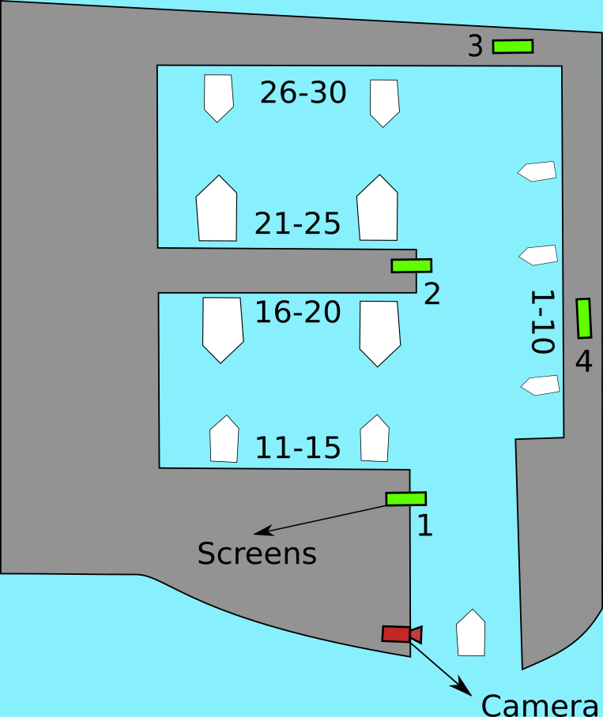
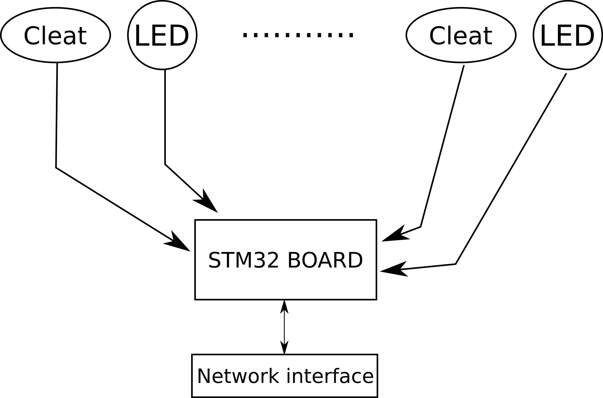
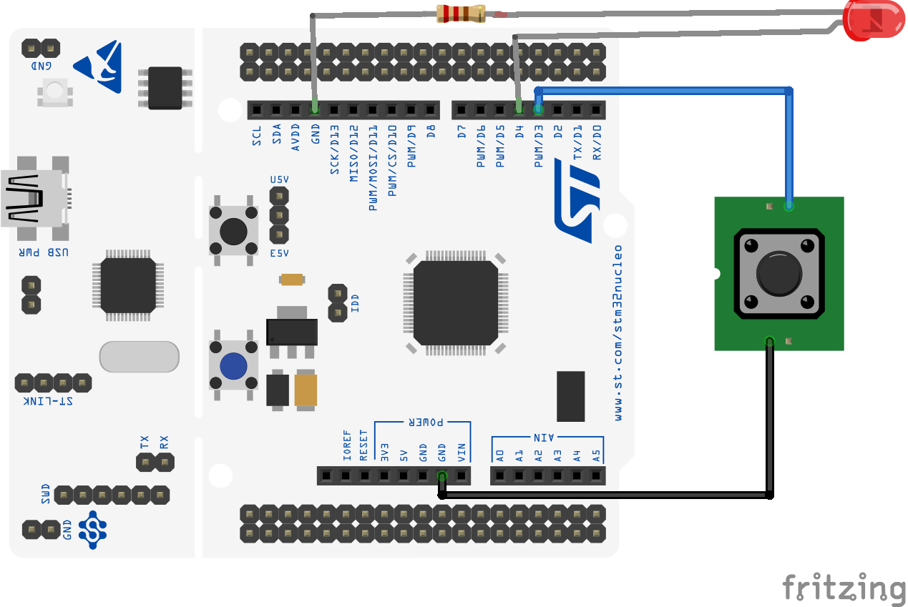
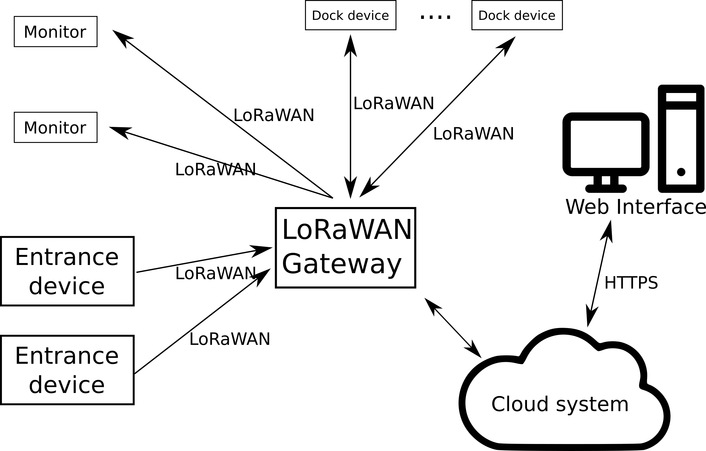
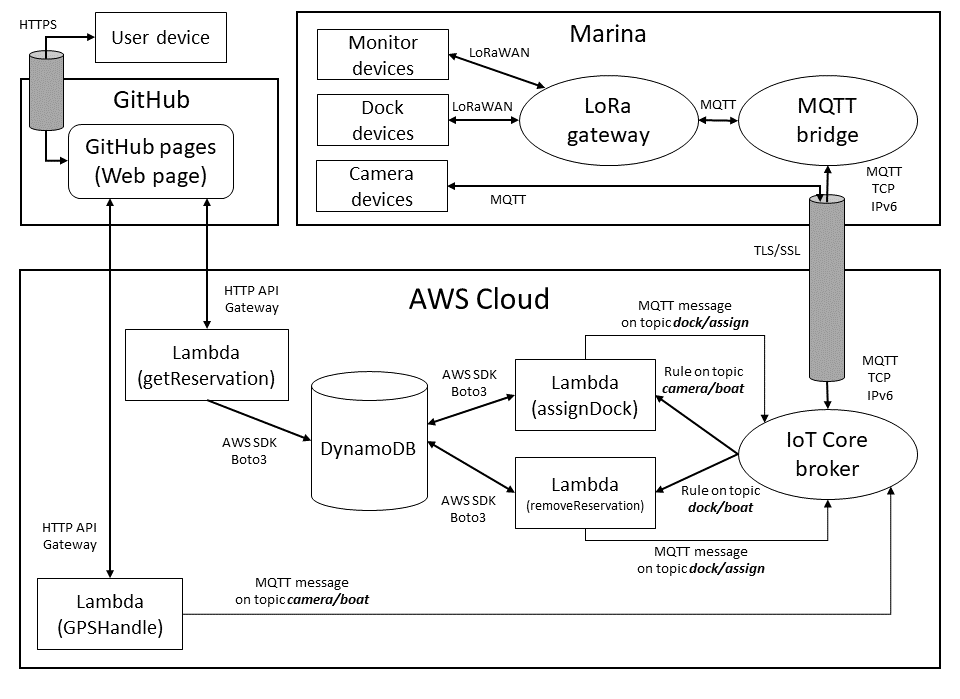

# Technology

*[First delivery version](https://github.com/kernel-machine/IoTGroupProject/tree/first_assignment/Technology.md)*

*[Second delivery version](https://github.com/kernel-machine/IoTGroupProject/tree/second_assignment/Technology.md)*

## Marina examples

In this project we will consider the following example of marina.

In this marina there 30 docking spots available placed in 5 different piers. Each pier can accommodate different type of boats:

- The docking spots from 1 to 10 has to be used by small boats (category 1)
- The docking spots from 11 to 15 and from 26 to 30 can accommodate also medium sized boats (category 2)
- The docking spots from 16 to 25 are the only one which can host also big boats (category 3)

The IoT system developed for this marina uses 30 docking devices, 4 LCD monitors and a camera.

## Main marina components

The main macro components are:

- **Camera** at the marina entrance used to identify the boat name to check if there is a dock reservation
- **Screens**, inside the marina there are some screens, useful to give indications at the sailor to find his dock spot
- **Dock device**, for each dock there is a sensor to detect if a boat is presents and a LED that blink when a sailor is searching his dock

## Dock device

For each dock there is a LED (that blink when someone has to find his docking spot) and a special cleat equipped with a button to detects if the boat is docked. More details about the cleat can be found [here](resources/cleat%203D%20model/).
A single stm32 board can be used for multiple docks, it uses a LoRaWAN interface to communicate with the LoRaWAN gateway installed on the marina.

The main components of the prototype of the dock device are:

- The main board STM32 Nucleo F401RE
- Cleat button
- LED

[Get more details here](src/Devices/DockDevice).

## Signage screen

The prototype of the monitor device is composed by a board:

- Nucleo STM32 F401RE
- OLED display 0.96" 128x64 

The display is driven by a SSD1306 and is connected to the main board via I2C.

This device is connected via LoRaWAN to the marina LoRaWAN gateway.

[Get more details here](src/Devices/MonitorDevice).

## Camera devices

For each side there are:

- **Camera** 
- **Raspberry PI 4** to read the name of the boat and send read data over MQTT on a LAN connection

Image processing is executed in the Raspberry Pi 4 and the read plate is sent.
It is possible to use multiple camera and the system will process the output of the first camera that detects a plate.

[Get more details here](src/Camera).

## Boat detection with GPS

If the camera device cannot detect the plate of a boat, there is a backup system that uses the GPS to detect when a boat is at the entrance of the marina. If the boat cannot be detected with the cameras, the sailor can open this [web page](https://kernel-machine.github.io/IoTGroupProject/#/gps), enter the boat plate, and, by keeping opened the web page, the boat position will be sent periodically to the cloud. When the marina system detects that the boat is near enough to the marina entrance, the sailor can close the web page and the signage will be shown on the monitors.

## Additional components

In the marina there are 2 additional components:

- **LoRaWAN gateway**, used to connect all the LoRa devices to the cloud.
- A **Marina server** to forward messages from the LoRaWAN gateway to the MQTT broker of IoT Core and vice versa 

## Software components and Network infrastructure

The major software components are:

- The **plate recognition software** in the cameras at the marina entrance
- A **web interface** used get a reservation and to use the enter detection system via GPS
- **Firmwares** of monitor and dock devices
- **Cloud software** that manages the reservation and assigns the dock. For more details visit the dedicated [folder](./src/AWS).

For the communication inside the marina LoRaWAN is used, while the cameras are connected directly to the AWS MQTT broker.

Software work flow examples:

- A boat enter in the marina and the entrance device sends the boat license plate to the marina server
- The marina server checks with the cloud system if there is a reservation for the boat entering and assigns a free docking spot suitable for the boat
- The marina server sends data to the monitors and to the dock device that start to show useful information for the sailor

## AWS infrastructure

On AWS cloud we have developed the cloud system with the following architecture:

We have 4 lambda function. The first one is `getReservation` and is called only from the web page to make a reservation that will be saved in a table of the marina DynamoDB. The second is called `assignDock` and is used to assign a docking spot when the system detects an incoming boat. The assigned dock is stored in the DynamoDB in another table used only for the docking spots status and the reservation status is updated to take into account that the boat arrived. At the end this lambda function sends an MQTT message to the docking devices and the displays to generate the correct signage to reach the docking.

With the `GPSHandle` function the boat identification made with the camera can be substituted with the GPS data coming from the web page opened on the sailor device.

When the boat reaches its docking spot a dock device message triggers the last lambda function called `removeReservation` which will communicate to all the docking devices that the docking procedure is completed.

To conclude when a docking device detects that a docking spot is free again because a boat leaved, it sends a message that triggers again the `removeReservation` function that in this case will delete the reservation and restore the docking spot status to free.

For more details about the messages exchanged by these components check the [dedicated folder](src/AWS).

## Prototype convention

To test the real hardware we didn't use LoRaWAN, but the board is connected to internet with ETHOS.

While for the network tests [The Things Network](https://www.thethingsnetwork.org/) is used, the boards are replaced with the [ST B-L072Z-LRWAN1](https://www.iot-lab.info/docs/boards/st-b-l072z-lrwan1/) and the values read by the sensors are replaced by simulated data.
