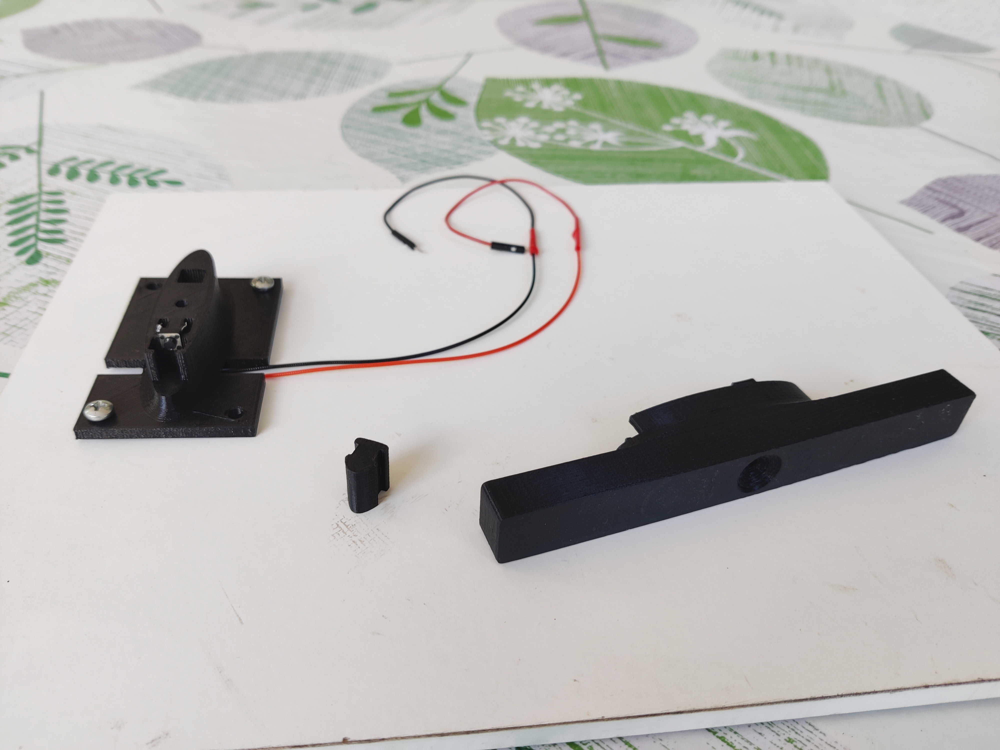
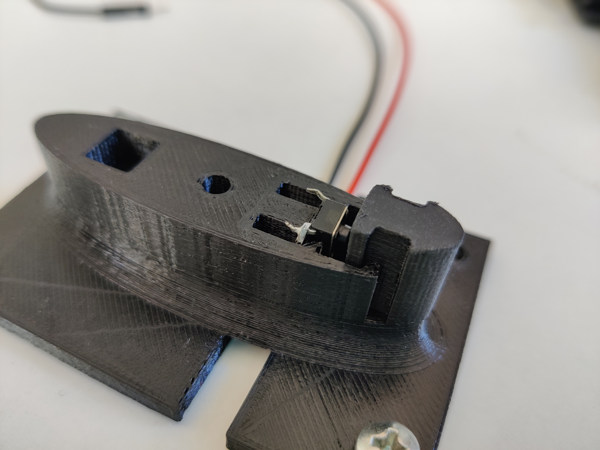
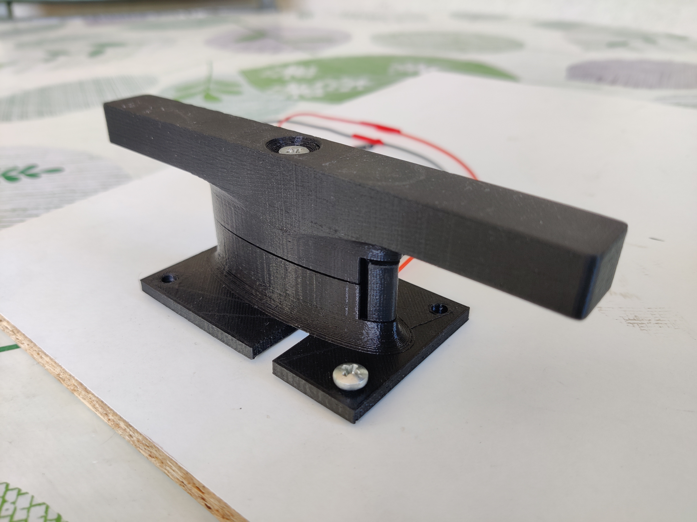
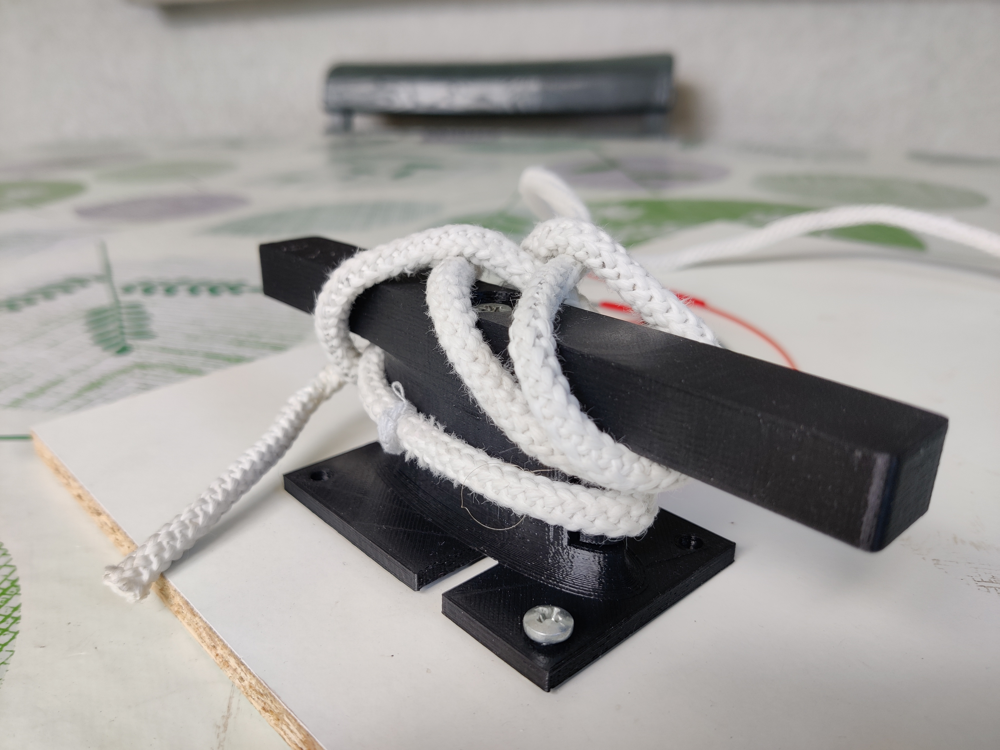

# Cleat sensor

To detect if a boat is docked we developed a special cleat equipped with a button which detects when there is a rope tied on it. In this way when a boat is docked using the cleat the rope presses the button.

The cleat model has been developed in 3 pieces that has to be assembled as it can be seen from the pictures.

For this prototype we printed the pieces in plastic (PLA) with a 3D printer only to give an idea on the feasibility of a cleat of this kind.